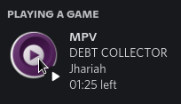

# Discord Rich Presence for MPV

A fast and reliable plugin for MPV which enables Discord Rich Presence. (This is also the world's first MPV plugin written in Rust, I swear, there are absolutely no docs anywhere for rust mpv plugins)



## Installation

Simply download the latest version of this plugin from the releases section and put the .so file in `~/.config/mpv/scripts`

## Installation from source

### Linux

To install from source

```bash
git clone https://github.com/StratusFearMe21/mpv_presence
cd mpv_presence
cargo build --release
cp target/release/libmpv_presence.so ~/.config/mpv/scripts
```

### Windows

C Plugins don't work on Windows unfortunately.
